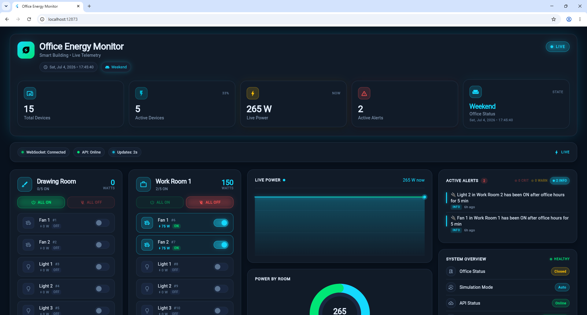
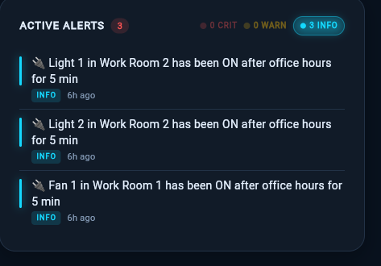
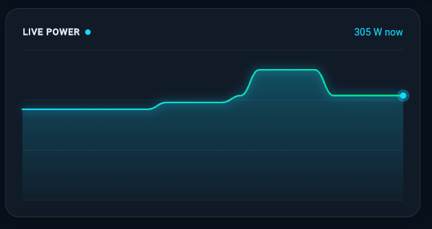
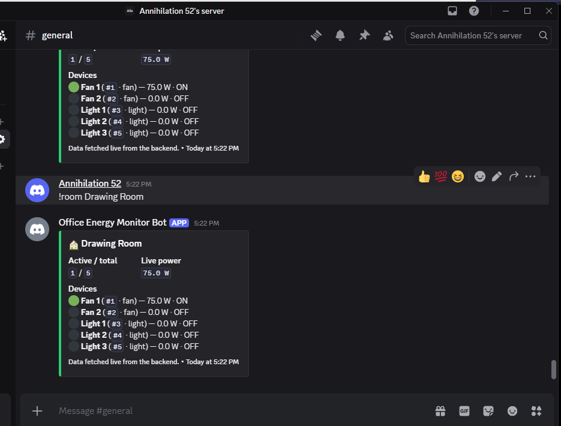

# Office Energy Monitoring System

> A production-quality real-time energy dashboard for small offices. Tracks
> every fan and light, simulates realistic usage, raises alerts when power
> spikes, and lets you query the building from Discord or the browser.

[](https://fastapi.tiangolo.com)
[](https://flutter.dev)
[](https://discordpy.readthedocs.io)
[](./docker-compose.yml)
[](./LICENSE)

---

## ✨ Features

- **Real-time dashboard** – Flutter Web with WebSocket updates, dark theme,
  live sparkline, room-level aggregation, activity feed and alerts panel.
- **REST API + WebSocket** – FastAPI 0.115 with async SQLAlchemy 2.0 and
  aiosqlite; full OpenAPI docs at `/docs`.
- **Simulation engine** – Office-hours-aware random toggling that runs in
  the background, raises alerts and broadcasts over WebSocket.
- **Discord bot** – `!status`, `!room`, `!usage`, `!alerts`, `!help` – all
  fetched live from the backend.
- **ESP32 ready** – Hardware documentation covers 3 rooms × 5 devices with
  relay wiring, ACS712 current sensing and an optocoupler-isolated 5 V rail.
- **Production packaging** – Dockerfile, docker-compose, static frontend
  build, nginx sample, Fly.io volume recipe.

---

## 📸 Screenshots

> The PNGs below live in [`demo_screenshots/`](demo_screenshots/) and are
> currently **labelled placeholders** generated so the badge paths resolve.
> Replace each file with a real capture before publishing — see
> [`demo_screenshots/README.md`](demo_screenshots/README.md) for guidance.

| Dashboard                                                      | Alerts panel                                              |
|----------------------------------------------------------------|-----------------------------------------------------------|
|                    |                    |

| Live power graph                                               | Discord bot                                               |
|----------------------------------------------------------------|-----------------------------------------------------------|
|                  |              |

---

## 🏗️ Architecture

| Diagram                                                                | Source                                                       |
|------------------------------------------------------------------------|--------------------------------------------------------------|
|                        | [`docs/architecture/diagram.drawio`](docs/architecture/diagram.drawio) (open in [app.diagrams.net](https://app.diagrams.net)) |
|                          | [`docs/hardware/README.md`](docs/hardware/README.md)         |
|                                 | [`docs/architecture/README.md`](docs/architecture/README.md) |

```
   ┌──────────────────────┐
   │ ESP32 hardware       │  (3 rooms × 5 devices, JSON / Wi-Fi)
   └──────────┬───────────┘
              ▼
      ┌──────────────────┐         ┌──────────────────────┐
      │  FastAPI backend │ ◄────── │ SQLite (aiosqlite)   │
      │  REST + WebSocket│         │ volume: backend_data │
      └──────────────────┘         └──────────────────────┘
        ▲              ▲
        │              │
        │              │
   Flutter Web    Discord bot
   dashboard      (discord.py)
   :8080          → backend
```

The full editable draw.io diagram is at `docs/architecture/diagram.drawio`.
See [`docs/architecture/README.md`](docs/architecture/README.md) for the
companion text covering the four-band view (ESP32 · FastAPI · Flutter ·
Discord).

### Components

| Component     | Tech                                                                              | Role                                                                                |
|---------------|-----------------------------------------------------------------------------------|-------------------------------------------------------------------------------------|
| `backend/`    | FastAPI 0.115 · SQLAlchemy 2.0 async · aiosqlite · APScheduler · Pydantic         | REST + WebSocket API, simulation engine, alert evaluation, persistence             |
| `frontend/`   | Flutter 3.35 (web) · http · web_socket_channel · Material 3 dark theme            | Live dashboard, room-level controls, alerts panel, connection indicator            |
| `discord_bot/` | discord.py 2.4 · httpx · Pydantic · AlertWatcher background task                  | Read commands (`!status`, `!alerts`, `!usage`), write commands (`!set_device`, `!set_room`, `!ack`), auto-post new alerts |
| `docs/`       | Markdown + drawio                                                                 | API reference, architecture, ESP32 BOM/wiring, deployment guides                   |
| `scripts/`    | `live_probe.py`                                                                   | End-to-end smoke test for REST + WebSocket                                         |

### Project workflow

```
   Simulation tick (APScheduler, default 5 s)
          │
          ▼
   Office-hours gate ─── closed ──► skip toggling
          │ open
          ▼
   Random device toggle (probability tied to office hours)
          │
          ├─► DeviceService.set_status() ──► Activity row + WS broadcast
          │
          └─► AlertService.evaluate() ──► Alert row + WS broadcast
                                         ──► AlertWatcher (discord) ──► Discord embed
```

---

## 🚀 Quick start

### Option A – Docker (one command)

```bash
docker compose up --build
```

The dashboard is on <http://localhost:8080>, the API on
<http://localhost:8000/docs>.

### Option B – Native (development)

```bash
# backend
cd backend
python -m venv .venv && source .venv/bin/activate   # or .venv\Scripts\Activate.ps1 on Windows
pip install -r requirements.txt
cp .env.example .env
uvicorn app.main:app --reload

# Discord bot
cd ../discord_bot
pip install -r requirements.txt
cp .env.example .env  # set DISCORD_BOT_TOKEN, BACKEND_URL
python -m app.bot

# Flutter web
cd ../frontend
flutter pub get
flutter run -d chrome \
  --dart-define=API_BASE_URL=http://localhost:8000 \
  --dart-define=WS_URL=ws://localhost:8000/ws
```

---

## ⚙️ Configuration

All runtime knobs live in environment variables. See the full reference
below.

### Backend (`backend/.env.example`)

| Variable                       | Default                                     | Purpose                                                                  |
|--------------------------------|---------------------------------------------|--------------------------------------------------------------------------|
| `DEBUG`                        | `true`                                      | Verbose logging.                                                         |
| `ENVIRONMENT`                  | `development`                               | Free-form label, surfaced in `/health`.                                  |
| `APP_NAME`                     | `Office Energy Monitoring System`           | Title in OpenAPI docs.                                                   |
| `HOST`                         | `0.0.0.0`                                   | uvicorn bind address.                                                    |
| `PORT`                         | `8000`                                      | uvicorn port.                                                            |
| `RELOAD`                       | `false`                                     | Pass `--reload` to uvicorn.                                              |
| `LOG_LEVEL`                    | `INFO`                                      | Standard Python log level.                                               |
| `DATABASE_URL`                 | `sqlite+aiosqlite:///./office_energy.db`    | Async SQLAlchemy URL. Swap to Postgres for production.                   |
| `CORS_ORIGINS`                 | `http://localhost:3000,http://localhost:8000,http://localhost:8080,*` | Comma-separated allow-list. `*` only for local dev.       |
| `SIMULATION_INTERVAL_SECONDS`  | `5`                                         | Tick period of the background simulator.                                 |
| `SIMULATION_ENABLED`           | `true`                                      | Master switch for the simulation loop.                                   |
| `OFFICE_START_HOUR`            | `8`                                         | Earliest hour (24-h clock) devices can be turned on.                     |
| `OFFICE_END_HOUR`              | `18`                                        | Latest hour (24-h clock) devices can be turned on.                       |
| `OFFICE_TIMEZONE`              | `UTC`                                       | Timezone used for the office-hours gate.                                 |
| `ALERT_WATT_THRESHOLD`         | `1500`                                      | Aggregate wattage above which an alert is raised.                        |
| `ALERT_OFF_HOURS_ACTIVE`       | `true`                                      | Whether alerts may fire outside office hours.                            |

### Discord bot (`discord_bot/.env.example`)

| Variable                  | Default                | Purpose                                                                                  |
|---------------------------|------------------------|------------------------------------------------------------------------------------------|
| `DISCORD_TOKEN`           | *(empty — required)*   | Bot token from the Discord developer portal. **Replace the placeholder before running.** |
| `COMMAND_PREFIX`          | `!`                    | Prefix for all cogs.                                                                     |
| `BACKEND_URL`             | `http://localhost:8000`| Base URL of the FastAPI backend. No trailing slash.                                      |
| `BACKEND_API_PREFIX`      | `/api/v1`              | Path prefix the backend exposes.                                                         |
| `REQUEST_TIMEOUT_SECONDS` | `10`                   | Per-request HTTP timeout.                                                                |
| `ALERT_CHANNEL_ID`        | *(empty)*              | Channel ID for auto-posting new alerts. Leave empty to disable.                          |
| `POLL_INTERVAL_SECONDS`   | `30`                   | How often the `AlertWatcher` polls `/api/v1/alerts/`.                                    |
| `ALERT_POLL_LIMIT`        | `50`                   | Maximum alerts fetched per poll.                                                         |
| `LOG_LEVEL`               | `INFO`                 | Standard Python log level.                                                               |

### Frontend (build-time `--dart-define`)

| Define         | Example                              | Purpose                                          |
|----------------|--------------------------------------|--------------------------------------------------|
| `API_BASE_URL` | `http://localhost:8000`              | Base for all REST calls (the bot adds `/api/v1`). |
| `WS_URL`       | `ws://localhost:8000/ws`             | Full WebSocket URL.                              |

The Flutter `Dockerfile` defaults both to `http://127.0.0.1:8001` and
`ws://127.0.0.1:8001/ws`; `docker-compose.yml` overrides them with the
in-network address (`http://backend:8000` and `ws://backend:8000/ws`).

---

## 🔌 REST API

Base URL: `http://localhost:8000`. All resource endpoints are mounted
under `/api/v1`. Full OpenAPI schema is at `/openapi.json`; Swagger UI at
`/docs`.

### Service endpoints

| Method | Path        | Purpose                                                                 |
|--------|-------------|-------------------------------------------------------------------------|
| GET    | `/`         | Returns `{"ok": true, "service": "office-energy"}`.                     |
| GET    | `/healthz`  | Liveness probe (process up — does not check the DB).                    |
| GET    | `/health`   | Liveness + DB reachable. Returns `503` if SQLite cannot be opened.       |
| GET    | `/ready`    | Readiness probe — `200` once the simulator has seeded rooms & devices.   |

### `/api/v1/devices`

| Method | Path                                       | Body / Query                              | Returns                                  |
|--------|--------------------------------------------|-------------------------------------------|------------------------------------------|
| GET    | `/api/v1/devices/`                         | —                                         | All devices (15 after seed).             |
| GET    | `/api/v1/devices/{device_id}`              | —                                         | Single device or `404`.                  |
| PATCH  | `/api/v1/devices/{device_id}`              | `{"status": "on" \| "off"}`               | Updated device; logs an `Activity` row and broadcasts a `device_update` on `/ws`. Returns `422` on an invalid status value. |
| GET    | `/api/v1/devices/rooms/{room}/devices`     | —                                         | Devices belonging to a room.             |

Device shape:

```json
{
  "id": 1,
  "name": "Drawing Room Fan 1",
  "room": "Drawing Room",
  "type": "fan",
  "status": "on",
  "power": 75,
  "last_changed": "2025-01-01T10:00:00Z"
}
```

Default wattages: **fan 75 W on / 0 W off**, **light 20 W on / 0 W off**.

### `/api/v1/rooms`

| Method | Path                            | Purpose                                                                                  |
|--------|---------------------------------|------------------------------------------------------------------------------------------|
| GET    | `/api/v1/rooms/`                | Per-room summary: `room`, `active_devices`, `total_devices`, `total_power`.              |
| GET    | `/api/v1/rooms/{room}`          | Single room summary.                                                                     |
| POST   | `/api/v1/rooms/{room}/on`       | Turn every device in the room on (rejected outside office hours).                         |
| POST   | `/api/v1/rooms/{room}/off`      | Turn every device in the room off.                                                        |
| GET    | `/api/v1/rooms/{room}/devices`  | Convenience alias of the devices endpoint filtered to this room.                         |

### `/api/v1/alerts`

| Method | Path                                  | Query                                  | Purpose                                                              |
|--------|---------------------------------------|----------------------------------------|----------------------------------------------------------------------|
| GET    | `/api/v1/alerts/`                     | `limit=50`, `acked=false`              | Most recent alerts, newest first.                                    |
| POST   | `/api/v1/alerts/{alert_id}/ack`       | —                                      | Mark an alert acknowledged. Idempotent. Returns `404` if not found.  |

Alert shape:

```json
{
  "id": 1,
  "device_id": 4,
  "message": "Sustained power above 1500 W",
  "severity": "warning",
  "created_at": "2025-01-01T10:00:00Z",
  "acknowledged": false,
  "acknowledged_at": null
}
```

### `/api/v1/activities`

| Method | Path                       | Query                                 | Purpose                                                |
|--------|----------------------------|---------------------------------------|--------------------------------------------------------|
| GET    | `/api/v1/activities/`      | `limit=50`, `room=Drawing Room`       | Device-toggle activity events, newest first.           |

Activity shape:

```json
{
  "id": 12,
  "device_id": 3,
  "device_name": "Work Room 1 Light 1",
  "action": "off",
  "room": "Work Room 1",
  "timestamp": "2025-01-01T10:00:00Z"
}
```

### `/api/v1/simulation`

| Method | Path                                | Purpose                                                                        |
|--------|-------------------------------------|--------------------------------------------------------------------------------|
| POST   | `/api/v1/simulation/start`          | Start (or replace) the background scheduler. Optional body `{"interval": 5}`.  |
| POST   | `/api/v1/simulation/stop`           | Stop the scheduler.                                                            |
| POST   | `/api/v1/simulation/pause`          | Pause ticks (does not unload the scheduler).                                   |
| POST   | `/api/v1/simulation/resume`         | Resume a paused scheduler.                                                     |
| POST   | `/api/v1/simulation/tick`           | Force a single tick immediately.                                               |
| GET    | `/api/v1/simulation/overview`      | Convenience aggregate: total / active devices, total power, active alerts, rooms. |

---

## 📡 WebSocket

**URL:** `ws://<host>:8000/ws`

### Envelope

Every message is a JSON object:

```json
{ "type": "<event>", "data": { ... } }
```

### Server → client events

| `type`             | `data` shape                                                                                          | Trigger                                              |
|--------------------|-------------------------------------------------------------------------------------------------------|------------------------------------------------------|
| `welcome`          | `{ "timestamp": "..." }`                                                                              | Sent once on `accept()`.                             |
| `simulation_tick`  | `{ "total_power": 410, "timestamp": "...", "changed": [<device_id>...] }`                            | Each scheduler tick.                                 |
| `device_update`    | `{ "device_id": 5, "status": "on", "room": "Work Room 1", "type": "fan" }`                           | A device's status changed (manual or simulated).     |
| `alert`            | `{ "id": 7, "device_id": 5, "message": "...", "severity": "warning" }`                                | A new alert was raised.                              |
| `alert_update`     | `{ "id": 7, "acknowledged": true, "acknowledged_at": "..." }`                                          | An alert was acknowledged.                           |
| `pong`             | `{ "ts": "..." }`                                                                                     | Reply to a client `ping`.                            |

### Client → server events

| `type` | `data`   | Effect                                          |
|--------|----------|-------------------------------------------------|
| `ping`  | `{}`     | Server replies with `pong`. Keep-alive only.    |

The Flutter `RealtimeService` handles auto-reconnect with exponential
back-off and a max-retry cap. The connection indicator pill in the top
bar maps `WsStatus.{connected,connecting,disconnected}` to
**Live / Connecting / Offline**.

---

## 🎲 Simulation engine

`SimulationScheduler` ticks every `SIMULATION_INTERVAL_SECONDS` (default
**5 s**) and, on each tick:

1. Asks `OfficeHoursService.is_office_open(now)` whether devices may
   change. Outside office hours, only **off** transitions are emitted
   (devices cannot be turned on).
2. Picks a small random subset of devices and calls
   `DeviceService.set_status`. Toggle probability is higher during office
   hours than outside.
3. Calls `AlertService.evaluate` which compares the new aggregate
   wattage against `ALERT_WATT_THRESHOLD` (default **1500 W**) and emits
   a new alert if needed.
4. Broadcasts the resulting `simulation_tick`, `device_update`, and (if
   applicable) `alert` envelopes to every connected WebSocket client.

You can pause, resume, or stop the loop with the `/api/v1/simulation/*`
endpoints or force a single tick with `/api/v1/simulation/tick`.

---

## 🚨 Alert system

| Severity   | When it fires                                                                                |
|------------|----------------------------------------------------------------------------------------------|
| `info`     | A noteworthy but non-critical state change (e.g. room toggled off outside office hours).     |
| `warning`  | Aggregate wattage crosses `ALERT_WATT_THRESHOLD`.                                            |
| `critical` | Sustained wattage above `2 × ALERT_WATT_THRESHOLD`, or a sustained spike inside office hours.|

Alerts are persisted in SQLite and pushed via `/ws`. The Discord bot's
`AlertWatcher` polls `/api/v1/alerts/` every `POLL_INTERVAL_SECONDS`,
persists the last-seen ID to a JSON state file
(`ALERT_WATCHER_STATE_PATH`), and posts a rich embed for any new entries
into `ALERT_CHANNEL_ID`. Acknowledging an alert calls
`POST /api/v1/alerts/{id}/ack` and broadcasts an `alert_update` envelope.

---

## 🤖 Discord bot

`EnergyBot(commands.Bot)` loads five cogs. Every command hits the
backend over HTTP — there is no local cache.

| Command                            | Aliases          | Backend call(s)                                                  | What it returns                                                                  |
|------------------------------------|------------------|------------------------------------------------------------------|----------------------------------------------------------------------------------|
| `!help`                            | —                | —                                                                | Lists every available command.                                                   |
| `!about`                           | —                | —                                                                | Project blurb + version.                                                         |
| `!status [room]`                   | —                | `GET /api/v1/rooms/`, `GET /api/v1/devices/rooms/{room}/devices` | Aggregate power + device counts for the building or one room.                    |
| `!set_device <id> on\|off`         | —                | `PATCH /api/v1/devices/{id}`                                     | Confirmation embed with the new status + power.                                 |
| `!set_room <room> on\|off`         | `!room`          | `POST /api/v1/rooms/{room}/on` / `…/off`                         | Confirmation embed for the bulk change.                                          |
| `!alerts [limit]`                  | —                | `GET /api/v1/alerts/`                                            | Most recent un-acknowledged alerts.                                              |
| `!ack <id>` / `!acknowledge <id>`  | —                | `POST /api/v1/alerts/{id}/ack`                                   | Marks the alert as acknowledged.                                                 |
| `!usage`                           | —                | `GET /api/v1/devices/`                                           | Count of active devices + estimated total wattage.                               |

`EnergyBot.setup_hook` polls `GET /healthz` until the backend is reachable
and **then** loads the cogs — so a slow backend startup will not crash the
bot on a fresh deploy.

---

## 🧯 Known issues

- **`discord_bot/.env.example` ships with a placeholder `DISCORD_TOKEN`.**
  Always replace it with your own bot token from the Discord developer
  portal before deploying. Do **not** commit a real token to source
  control.
- The Flutter web build embeds `API_BASE_URL` / `WS_URL` at compile
  time. Rebuild the image if you change the backend host.
- `office_energy.db` lives on the `backend_data` named volume inside
  Compose. Outside Compose it lives next to `app/main.py`.
- The bundled Discord bot's `!ack` command requires
  `ALERT_CHANNEL_ID` to be set; without it, alerts are still polled but
  not auto-posted.

---

## 🛣️ Future improvements

- **Postgres backend** — swap the `sqlite+aiosqlite:///` URL for
  `postgresql+asyncpg://` and add a Compose service.
- **Authentication** — the dashboard currently trusts the network (LAN
  or reverse-proxy allow-list). A token-based auth layer on
  `/api/v1/devices` PATCH + `/api/v1/simulation/*` would let the stack
  leave the LAN.
- **Hardware integration** — an ESP32 firmware that POSTs real
  wattage readings into `/api/v1/devices/{id}` (`PATCH`/`status`),
  replacing the simulator with the data plane described in
  [`docs/Hardware.md`](./docs/Hardware.md).
- **Historical charts** — the sparkline currently keeps a rolling
  window in memory; persisting samples would unlock 7-day / 30-day
  dashboards.
- **WebSocket authentication** — currently any client that can reach
  `/ws` subscribes to the full event stream.
- **Multi-tenant rooms** — promote `RoomName` from an enum to a table
  and let operators register rooms dynamically.
- **Mobile shell** — the Flutter codebase already targets all Flutter
  platforms; running `flutter build apk` would ship an Android client
  with no extra code.
- **Discord slash commands** — `app_commands` would replace the prefix
  cogs with native `/`-style commands.

---

## 📦 Project layout

```
office-energy-monitor/
├── backend/                   FastAPI service (Python 3.11 + SQLAlchemy 2 async)
│   ├── app/
│   │   ├── api/               Routers: devices, rooms, alerts, activities, simulation
│   │   ├── core/              Config, logging, constants
│   │   ├── db/                Async SQLAlchemy session factory
│   │   ├── models/            ORM models (Device, Alert, Activity)
│   │   ├── schemas/           Pydantic request / response schemas
│   │   ├── services/          DeviceService, AlertService, OfficeHours, Simulation, Scheduler
│   │   ├── websocket/         ConnectionManager + /ws routes
│   │   └── main.py            App factory, lifespan, router wiring
│   ├── tests/                 pytest + pytest-asyncio suite
│   ├── requirements.txt
│   └── .env.example
│
├── frontend/                  Flutter Web dashboard
│   ├── lib/
│   │   ├── main.dart             App entry, MaterialApp + theme wiring
│   │   ├── config.dart           --dart-define-driven endpoints
│   │   ├── models/device.dart    Device, RoomSummary, OverviewStats, Alert, Activity
│   │   ├── screens/dashboard_screen.dart   Top-level layout
│   │   ├── services/
│   │   │   ├── api_service.dart         REST client
│   │   │   ├── realtime_service.dart    WebSocket client + reconnect
│   │   │   └── dashboard_state.dart     ChangeNotifier state container
│   │   ├── theme/app_theme.dart         Material 3 dark palette
│   │   └── widgets/                     13 reusable widgets
│   │       ├── system_overview_card.dart
│   │       ├── active_alerts_card.dart
│   │       ├── alert_list.dart
│   │       ├── room_card.dart
│   │       ├── device_row.dart
│   │       ├── stat_card.dart
│   │       ├── animated_counter.dart
│   │       ├── connection_indicator.dart
│   │       ├── status_bar.dart
│   │       ├── header_card.dart
│   │       ├── glass_card.dart
│   │       ├── live_power_chart.dart
│   │       └── power_by_room_doughnut.dart
│   ├── test/                  widget_test.dart
│   ├── web/                   index.html + manifest.json
│   ├── Dockerfile             2-stage: Flutter SDK → nginx:alpine
│   └── nginx.conf
│
├── discord_bot/               discord.py bot
│   ├── app/
│   │   ├── bot.py             EnergyBot lifecycle + setup_hook
│   │   ├── config.py          pydantic-settings + dotenv
│   │   ├── models.py          Pydantic mirrors of backend responses
│   │   ├── api_client.py      httpx wrapper with typed errors
│   │   ├── embed_builder.py   All Discord embeds
│   │   ├── cogs/              help, status, room, usage, alerts
│   │   └── services/
│   │       └── alert_watcher.py    Background /alerts poller with persistent cursor
│   ├── tests/                 pytest suite (30 tests)
│   ├── requirements.txt
│   ├── Dockerfile
│   └── .env.example
│
├── docs/
│   ├── API.md                 REST + WebSocket reference
│   ├── Architecture.md        Mermaid diagrams + component responsibilities
│   ├── Backend.md             Backend deep-dive
│   ├── Frontend.md            Flutter architecture, state, widgets
│   ├── DiscordBot.md          Bot architecture, commands, embeds
│   ├── Database.md            ER diagram, schema, lifecycle
│   ├── Simulation.md          Tick loop, office hours, alert rules
│   ├── Hardware.md            ESP32 BOM, wiring, firmware contract
│   ├── Deployment.md          Native, Docker, cloud, env vars
│   ├── Testing.md             Backend / bot / Flutter / E2E strategy
│   ├── ProjectAudit.md        Code smells, dead code, naming, perf
│   ├── api/README.md          Legacy API doc (kept for historical link)
│   ├── architecture/          diagram.drawio + prose
│   ├── hardware/README.md     Hardware reference (merged into Hardware.md)
│   └── DEPLOYMENT.md          Legacy deployment doc
│
├── scripts/
│   └── live_probe.py          End-to-end REST + WebSocket smoke test (no auth, no DB)
│
├── docker-compose.yml         3 services: backend, frontend, discord
├── Dockerfile                 Root image (used by `backend` service)
├── LICENSE                    MIT
└── README.md                  You are here.
```

---

## 🧪 Testing

### Backend

```bash
cd backend
python -m venv .venv && source .venv/bin/activate   # .venv\Scripts\Activate.ps1 on Windows
pip install -r requirements.txt
pytest -v
```

The backend suite uses `pytest` + `pytest-asyncio`, swaps the engine
for an in-memory SQLite, and covers:

- `DeviceService.set_status` happy-path + invalid-status rejection.
- `OfficeHoursService.is_office_open` across weekday boundaries and
  timezone edge cases.
- End-to-end REST round-trips on `/api/v1/devices`, `/rooms`,
  `/alerts`, and `/simulation`.
- WebSocket lifecycle: `welcome` envelope on connect, `simulation_tick`
  arrival after the first scheduler tick.

### Discord bot

```bash
cd discord_bot
pip install -r requirements.txt
pytest -v
```

Uses `httpx.MockTransport` for the API client and tiny fakes for
`discord.py` objects — no network and no Discord connection needed.

### Live smoke test

```bash
python scripts/live_probe.py
```

Hits `/health`, `/api/v1/rooms/`, `/api/v1/devices/`,
`/api/v1/alerts/`, then opens a WebSocket and prints the first
`simulation_tick` payload. Requires the backend to be running.

---

## 📚 Documentation

* [`docs/api/README.md`](docs/api/README.md) – REST & WebSocket reference
* [`docs/hardware/README.md`](docs/hardware/README.md) – ESP32 BOM & wiring
* [`docs/architecture/diagram.drawio`](docs/architecture/diagram.drawio) –
  visual architecture
* [`docs/DEPLOYMENT.md`](docs/DEPLOYMENT.md) – native / docker / cloud

---

## 🤝 Contributing

1. Fork the repo.
2. Create a feature branch (`git checkout -b feature/awesome`).
3. Run the test suites (`cd backend && pytest -v && cd ../discord_bot && pytest -v`).
4. Make sure the dashboard still builds (`cd frontend && flutter build web`).
5. Open a PR.

> A `CONTRIBUTING.md` will be added once the project picks up external
> contributors. Until then, the workflow above is the source of truth.

---

## 👥 Contributors

| Name        | Role                                                              |
|-------------|-------------------------------------------------------------------|
| **Jakaria** | Author, maintainer — backend, frontend, discord bot, docs, infra. |

> If you have contributed and would like to be listed here, please open
> a PR that adds your name + a one-line description of your area.

---

## Project Demo On Youtube 
Link > https://youtu.be/vgd3OltJ69Q?si=XBC9C1QYqjSL1kGp

## 📝 License

MIT — see [`LICENSE`](./LICENSE).
